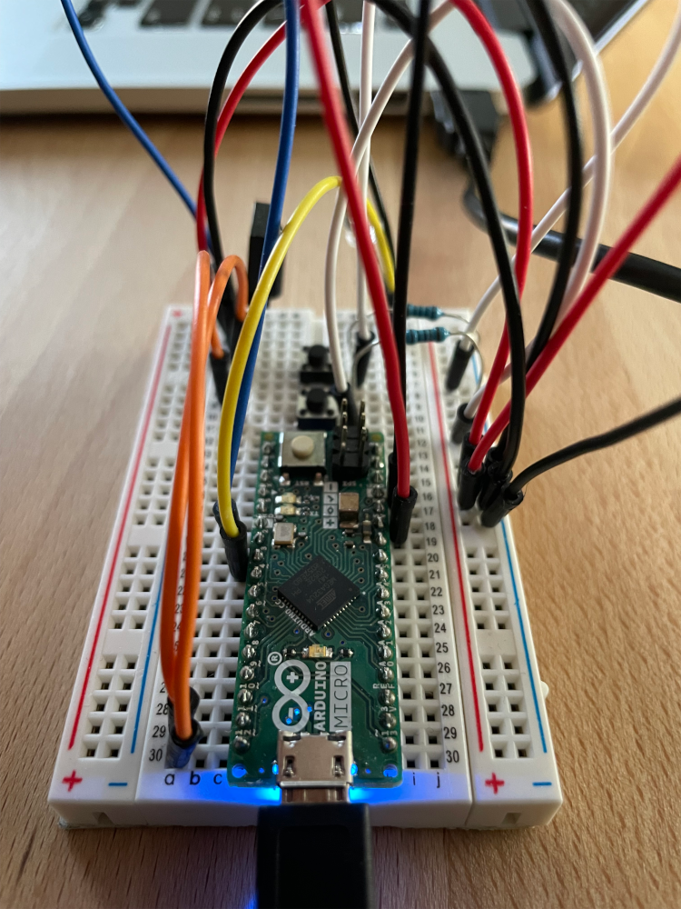
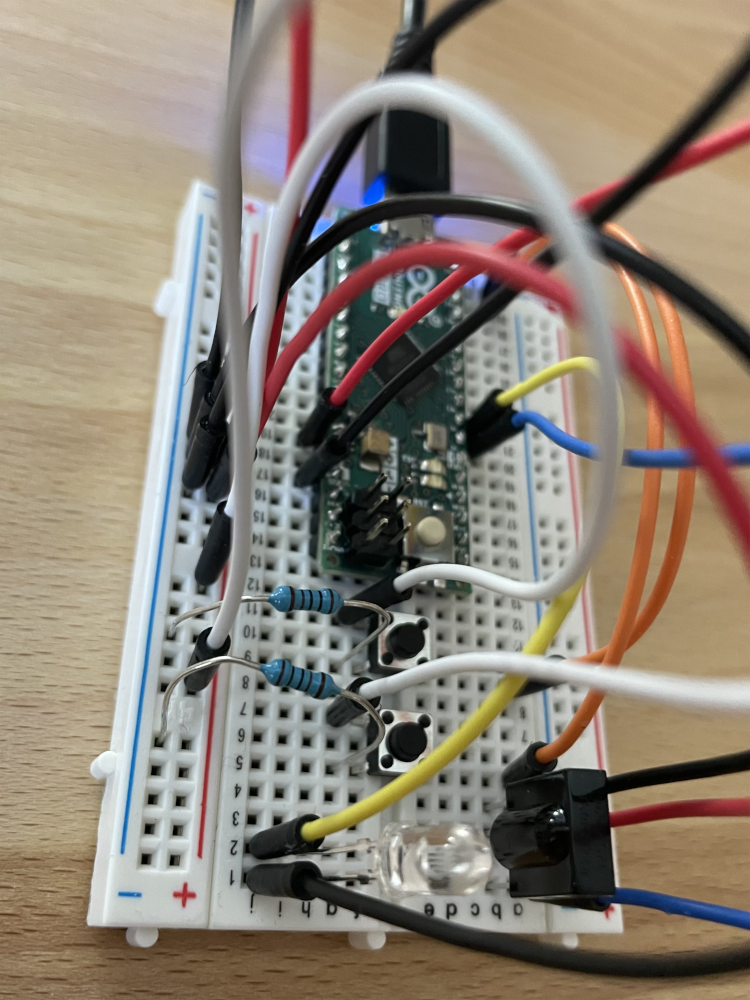

# IR Controller

This is a bunch of code files that allowed me to transform my very own Arduino setup into an IR (Infra Red light) controller, for my very own need.

## Requirements

- An Arduino (I have the Micro version)
- An IR LED on Arduino's digital pin #2
- An IR sensor on Arduino's digital pin #3
- 2 push buttons, on Arduino's digital pins #11 and #12
- Some wires and resistors
- VSCode with the Arduino plugin, or the average Arduino IDE
- The IRMP library

Of course, this is a very specifc and personal setup.

## The story

Here's the story of this tiny, fun project, for those who are interested.. (just me)

### Context and functional need
- For some (good!) reason, I just acquired an Apple TV
- My current TV (my landlord's) does not support volume control over Toslink
- My Hifi amp (an Atoll HD120, coupled to an Atoll MA100, solid FR hardware) is connected to my TV through Toslink
- Hence, my Apple TV remote cannot control the sound (+/-/mute) in any way
- I discover the Apple TV can "record remote signals" to program its own remote, so that it emits the same IR signals
- I do not own a remote compatible with my amp, but I discovered that one exists
- Atoll, the amp manufacturer, [provides the IR codes of the remote](https://www.atoll-electronique.com/wp-content/uploads/2015/08/Remotes-controls-ATOLL-devices.pdf)
- The remote costs 45€, but I would use it only once (3 button presses!), to program my Apple TV's remote
- I look up "IR programming" solutions and quickly confirm my intuition that an Arduino would work well
- The whole Arduino and related hardware would also cost around 45€, but would involve a lot of work
- Whatever, let's go!

### Learning Arduino through baby steps
- First things first: getting warmed up with an Arduino Hello World!
- Basic Arduino circuitry and control, with two stupid LEDs
- Following an "IR signals recorder" Arduino example on the Internet, using an old remote to validate my code and setup
- Tweaking it a little to have a better grasp, add my own IR LED and use it to emit signals (check I receive what I send)
- In the process, learn to hate the simplistic Arduino IDE, try with VSCode, manage its tedious Arduino plugin setup
- I realize Internet's examples with a 100ohm resistor on the IR LED line produce too weak a signal: this one is gone

### The hard part
- Try to use the library's "Panasonic protocol" function, notice how non-straightforward it is, and how manufacturer codes don't match
- Manufacturer codes byte names don't match the standard, checksums rarely match either, the protocol is old and poorly documented
- I spend hours and hours trying new things, looking for equivalent hardware, hunting for intel about what protocol is actually expected by my amp
- I try a new library, dig docs only accessible through [the wayback machine](https://archive.org/)
- I think I identify a hardware protocol that matches (the bytes count, carrier freq and timings match) but the byte wrangling (checksum etc) differ
- I "hack" the lib and remove the bit manipulation parts to directly emit the byte buffer I provide
- It miraculously worked, I could not believe my eyes it did
- Groom the code and implement everything: one button will be command toggle, the other will be the command signal emission
- Eventually, everything worked like a charm, my Apple TV now controls my amp.. what a satisfatory feeling!

## Some pics

